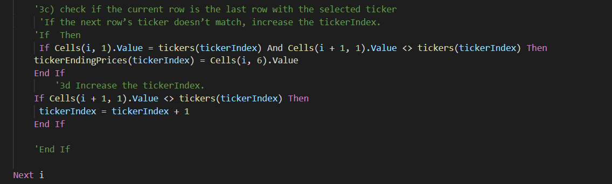

# Stock Analysis
We will refactor VBA code to loop through Stock results more efficiently
## Overview of Project
Steve had asked for our help to analyze different stocks so that his parents can make the best decision about what stock to invest in.
### Purpose
The purpose is to refactor the VBA code so that we can loop through only once and having a more efficient run time.
## Results
To begin refactoring the code we created output arrays for each of our variables. The goal is to make our analysis more efficient and by reducing the number of times the code must loop through different variables, we are able to do so. We kept the array from the original code for tickers. We created output arrays tickerVolumes(), tickerStartingPrices(), and tickerEndingPrices().  We created the variable tickerIndex to refer to the tickers in our initial array. We set this variable equal to zero and prepared to run our loop through our datasheet  
 

 
To run analysis through the spreadsheet we created a for loop to run through the dataset, just like the original code. We first created a ticker to increase volume as the code ran through each cell. We set each of our tickerVolumes(i) equal to zero in a previous For Loop. In our current For loop we ran through each cell and added each volume until we reached the end of the ticker by referencing tickerIndex as seen in the code below.  
 

 
We then needed to find our ending prices and starting prices. Instead of creating a nested For loop and running a new loop for each ticker to find volume and then looping through rows to find starting/ending prices , we can use our variable tickerIndex to loop through more efficiently.  
 

 
Lastly we created a new datasheet and were able to display the results for each variable using our arrays for each ticker. When we ran out refactored code we saw an increased performance for both data sets. The original codes ran for .496 seconds for 2017 and .484 seconds in 2018. Our new times are shown below  
 

 

 

 

### Advantages and Disadvantages of Refactoring Code
Refactoring can have great advantages because it allows the collaborative nature of coding to bloom. New eyes can bring a new take and add different ways of coding. There is always room for improvement and this allows coders a chance to improve their code. It each code to be made more effective and improve readability. 
Refactoring code can be disadvantageous is not effective. This could be if the code used is out of date and their our other methods and programs that work better than the one used. It might be more beneficial for some projects to start fresh.
### Advantages and Disadvantages of Refactored VBA script
Some advantages of refactored VBA script is we can see the efficiency of our refactoring by comparing coding time. As seen above with the results of our refactored code, we have significantly improved out code performance. The original codes ran for .496 seconds for 2017 and .484 seconds in 2018. We now have performance times of .199 for our 2017 analysis and .191 time for our 2018 analysis. This shows just how effective and essential refactoring code can be in VBA script. A disadvantage is that if there is a language or program that works better for out project we would not be able to refactor the VBA script but would have a better time restarting the code in a new program. 
